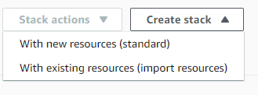
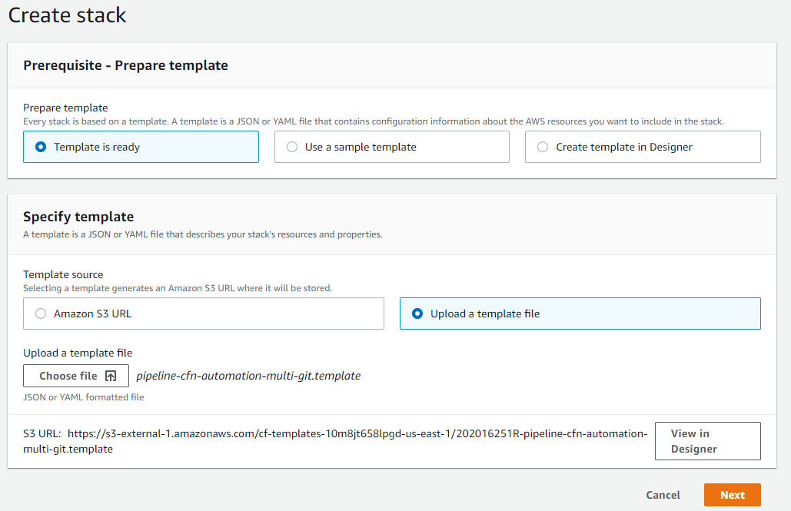
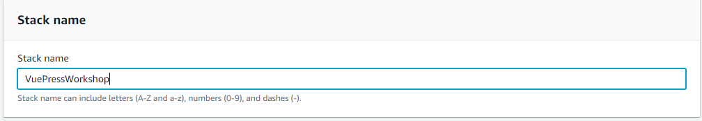
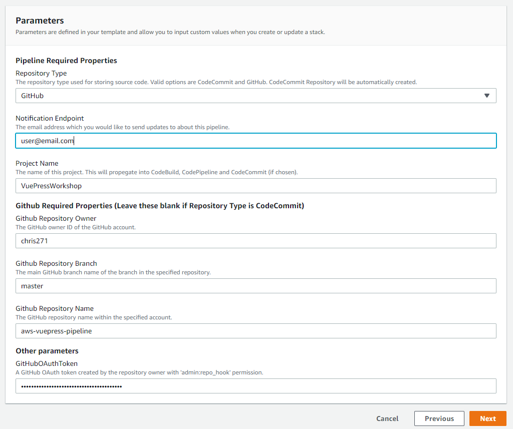
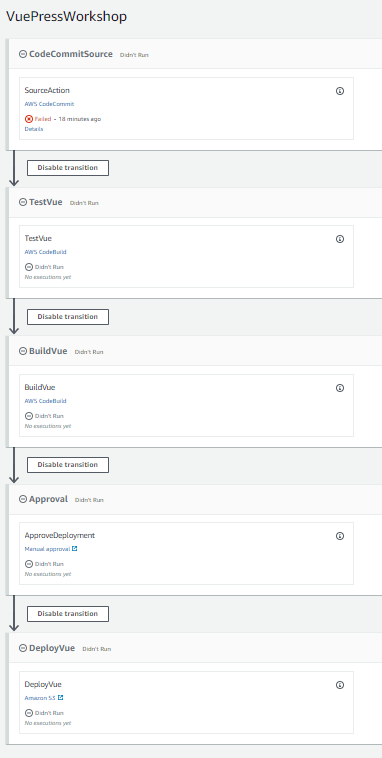
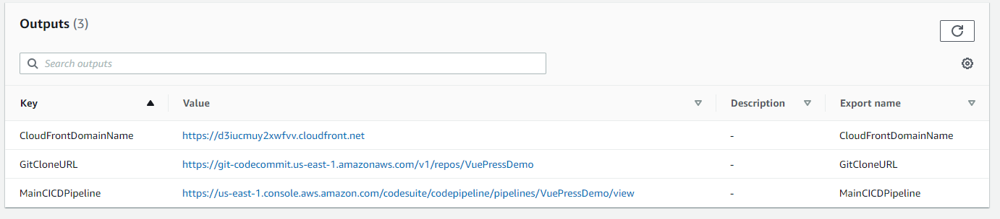

# VuePress CodePipeline Workshop

Sample project to create an AWS CodePipeline pipeline to deploy a static VuePress website.

## Getting Setup

### Prerequisites

1.  [Node.js](https://nodejs.org/en/) v8.0+
2.  [AWS CLI](https://docs.aws.amazon.com/cli/latest/userguide/cli-chap-install.html)
3.  [Default AWS Credential Profile](https://docs.aws.amazon.com/cli/latest/userguide/cli-configure-profiles.html)
4.  [Setup an IAM User with CodeCommit Credentials](https://docs.aws.amazon.com/codecommit/latest/userguide/setting-up-gc.html) (If you choose to use CodeCommit repository)

### Local VuePress Setup Instructions

1.  [Clone this repo](https://github.com/chris271/aws-vuepress-pipeline)
2.  Run `yarn install` or `npm install`
3.  Run `yarn run dev` or `npm run dev` to run the VuePress site locally.
3.  Run `yarn run test` or `npm run dev` to run the unit tests located in `docs/.vuepress/components/__tests__`.

## CodePipeline CloudFormation Deployment

### Deploying the Provided Template

- Navigate to CloudFormation within the AWS Console  

- Click "Create Stack" then select "With new resources (standard)"
  


- Select "Upload a template file" and click "Browse"  



- Choose the "pipeline-cfn-automation-multi-git.template" template file at the base of this repo.  

- Enter a value for the Stack Name (ex. "VuePressWorkshop")  



- For parameters first select the "Repository Type" you would like to use.  

- If "CodeCommit" is selected for "Repository Type" then skip the next step and all sub-steps.  

- When "GitHub" is selected for "Repository Type" 
  - Enter the Github repository owner's username for "Github Repository Owner"
  - Enter the Github repository name for "Github Repository Name"
  - Enter the Github repository branch name for "Github Repository Branch"
  - Generate a Github [Personal Access Token](https://help.github.com/en/github/authenticating-to-github/creating-a-personal-access-token-for-the-command-line) 
  with "admin:repo_hook" permission and paste the resulting value in the "GitHub OAuth Token" field.  
  
- Select a value for "Notification Endpoint" which should be an email that will receive pipeline notifications.

- Select a value for "Project Name" which will propagate to the names of pipeline resources.  

- When all parameters are selected the screen should look similar to below.  



- Once all parameters have been selected create the stack and await for a CREATE_COMPLETE state.

### Review the Template Pipeline

While the stack is in the creation process you can take the time to review the provided template. Below are the major sections of the template which define the pipeline.

- The main pipeline definition defines the IAM role the pipeline will assume and where to store build artifacts.
  
```yaml
#Main CodePipelinepipeline for the stack.
#Props Link: https://docs.aws.amazon.com/AWSCloudFormation/latest/UserGuide/aws-resource-codepipeline-pipeline.html
CodePipeline:
  Type: AWS::CodePipeline::Pipeline
  Properties:
    ArtifactStore:
      Type: S3
      Location: !Ref PipelineBucket
    RoleArn: !GetAtt CodePipelineRole.Arn
    Name: !Ref ProjectName
    Stages:
      ...
```

- The deployed pipeline will have 5 stages "Source", "Test", "Build", "Approval", and "Deploy" as you can see below.



- The source stage is conditional based on the selected "Repository Type" parameter.

```yaml
#If CodeCommitRepo is true then use CodeCommit source, otherwise use a Github source
- !If
  - CodeCommitRepo
  - Name: CodeCommitSource
    Actions:
      - Name: SourceAction
        ActionTypeId:
          Category: Source
          Owner: AWS
          Version: 1
          Provider: CodeCommit
        OutputArtifacts:
          - Name: "RepoSource"
        Configuration:
          BranchName: "master"
          RepositoryName: !Ref ProjectName
        RunOrder: 1
  - Name: GitHubSource
    Actions:
      - Name: SourceAction
        ActionTypeId:
          Category: Source
          Owner: ThirdParty
          Version: 1
          Provider: GitHub
        OutputArtifacts:
          - Name: "RepoSource"
        Configuration:
          Owner: !Ref GitHubOwner
          Repo: !Ref GitHubRepositoryName
          Branch: !Ref GitHubBranchName
          OAuthToken: !Ref GitHubOAuthToken
          PollForSourceChanges: true
        RunOrder: 1
```

- The test stage will use the PipelineCodeBuildTestProject build project and utilize the 'buildspec-test.yaml' as below.

```yaml
  #This CodeBuild project is used in the pipeline during the test stage
  PipelineCodeBuildTestProject:
    Type: AWS::CodeBuild::Project
    Properties:
      Artifacts:
        Type: CODEPIPELINE
      Environment:
        ComputeType: "BUILD_GENERAL1_SMALL"
        Image: "aws/codebuild/amazonlinux2-x86_64-standard:1.0"
        Type: LINUX_CONTAINER
      Name: !Sub "${ProjectName}-Test"
      ServiceRole: !GetAtt CodeBuildRole.Arn
      Source:
        BuildSpec: buildspec-test.yaml
        Type: CODEPIPELINE
```

- This buildspec will have CodeBuild lint and run unit tests for the VuePress project

```yaml
# Buildspec Reference: https://docs.aws.amazon.com/codebuild/latest/userguide/build-spec-ref.html
version: 0.2

phases:
  install:
    runtime-versions:
      nodejs: 10
  build:
    commands:
      - npm install
      - npm run lint
      - npm run test

```

- The test stage definition appears as below in the pipeline definition. This stage has an input from the "RepoSource" artifact which comes from the Source stage.

```yaml
#Run build using 'buildspec-test.yaml' to lint and run unit tests for current source
- Name: TestVue
  Actions:
    - Name: TestVue
      ActionTypeId:
        Category: Test
        Owner: AWS
        Version: 1
        Provider: CodeBuild
      InputArtifacts:
        - Name: "RepoSource"
      Configuration:
        ProjectName: !Ref PipelineCodeBuildTestProject
      RunOrder: 1
```

- The build stage will use the PipelineCodeBuildProject build project and utilize the 'buildspec-build.yaml' as below.  

```yaml
  #This CodeBuild project is used in the pipeline during the build stage
  #Props Link: https://docs.aws.amazon.com/AWSCloudFormation/latest/UserGuide/aws-resource-codebuild-project.html
  PipelineCodeBuildProject:
    Type: AWS::CodeBuild::Project
    Properties:
      Artifacts:
        Type: CODEPIPELINE
      Environment:
        ComputeType: "BUILD_GENERAL1_SMALL"
        Image: "aws/codebuild/amazonlinux2-x86_64-standard:1.0"
        Type: LINUX_CONTAINER
      Name: !Sub "${ProjectName}-Build"
      ServiceRole: !GetAtt CodeBuildRole.Arn
      Source:
        BuildSpec: buildspec-build.yaml
        Type: CODEPIPELINE
```

- This buildspec will have CodeBuild build the VuePress project and output the resulting build files.  

```yaml
# Buildspec Reference: https://docs.aws.amazon.com/codebuild/latest/userguide/build-spec-ref.html
version: 0.2

phases:
  install:
    runtime-versions:
      nodejs: 10
  build:
    commands:
      - npm install
      - npm run build
      - mkdir dist
      - cp -a docs/.vuepress/dist/* dist/

artifacts:
  files:
    - "**/*"
  discard-paths: no
  base-directory: dist
```

- The build stage definition appears as below in the pipeline definition. This stage has an input from the "RepoSource" artifact from the Source stage and an ouput called "BuildOutput" which will be used in the Deploy stage.

```yaml
- Name: BuildVue
  Actions:
    - Name: BuildVue
      ActionTypeId:
        Category: Build
        Owner: AWS
        Version: 1
        Provider: CodeBuild
      InputArtifacts:
        - Name: "RepoSource"
      OutputArtifacts:
        - Name: "BuildOutput"
      Configuration:
        ProjectName: !Ref PipelineCodeBuildProject
      RunOrder: 1
```

- The Approval stage appears as below and will require the user to manually review the stage before moving to the Deploy stage.

```yaml
- Name: "Approval"
  Actions:
    - Name: "ApproveDeployment"
      ActionTypeId:
        Category: Approval
        Owner: AWS
        Version: "1"
        Provider: Manual
      Configuration:
        ExternalEntityLink: !If
          - CodeCommitRepo
          - !Sub "https://git-codecommit.${AWS::Region}.amazonaws.com/v1/repos/${ProjectName}"
          - !Sub "https://github.com/${GitHubOwner}/${GitHubRepositoryName}.git"
        CustomData: "Approval to deploy the built artifact to S3"
```

- The Deploy stage will finally deploy the "BuildOutput" artifact to S3. CloudFront will pick up the changes to the bucket and refresh the VuePress site when deployed.

```yaml
- Name: DeployVue
  Actions:
    - Name: "DeployVue"
      ActionTypeId:
        Category: Deploy
        Owner: AWS
        Version: "1"
        Provider: S3
      Configuration:
        {
          BucketName: !Ref ArtifactBucket,
          Extract: true
        }
      InputArtifacts:
        - Name: "BuildOutput"
      RunOrder: 1
```

### Running the Pipeline

- When the stack finishes creation navigate to the CloudFormation stack "Outputs" tab and click the link for "MainCICDPipeline".  



- To run the pipeline you will need to make a commit to the CodeCommit or Github repo attached to the Source stage of the pipeline.

## Helpful links

This site is built on [VuePress](https://vuepress.vuejs.org/). Please see their [Guide](https://vuepress.vuejs.org/guide/) for more information on how it works. 

The provided VuePress sample is based on [this repository](https://github.com/bencodezen/vuepress-starter-kit) with adjustments.
